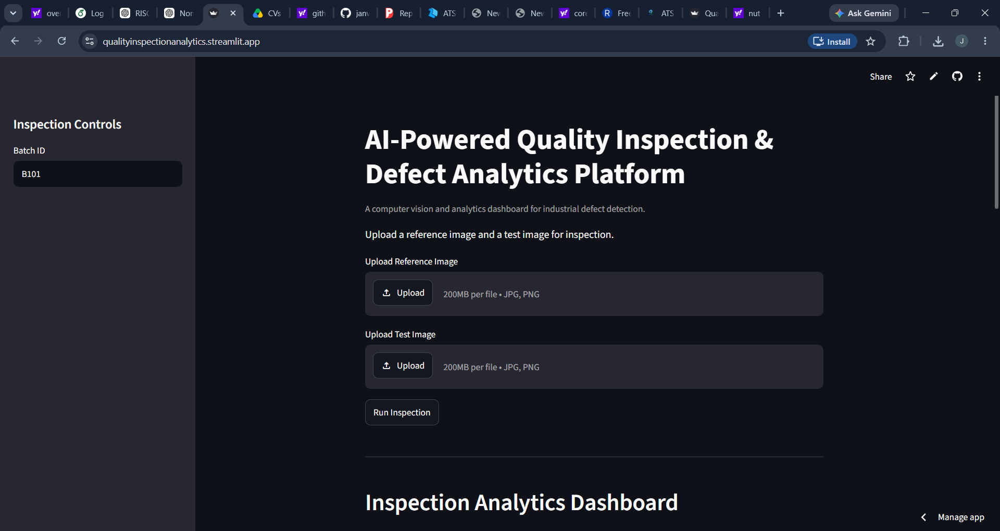
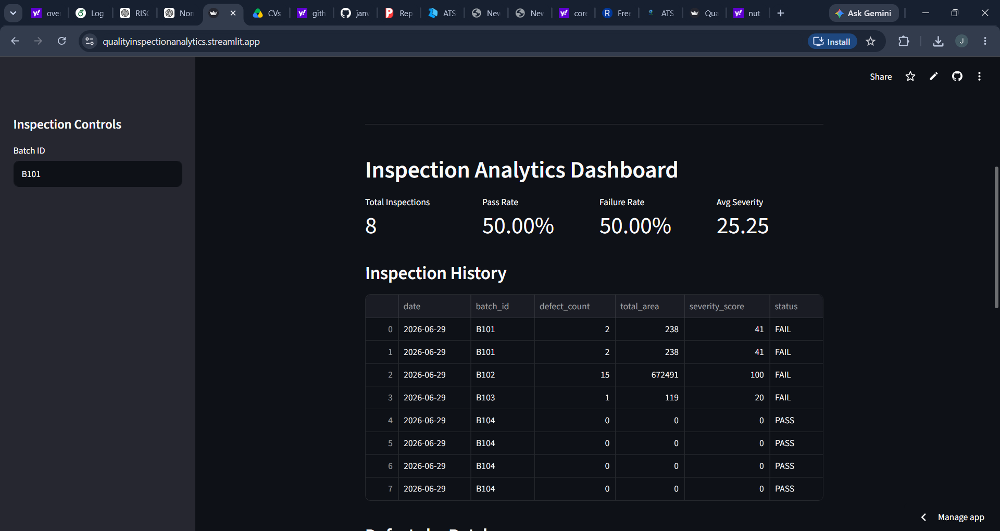
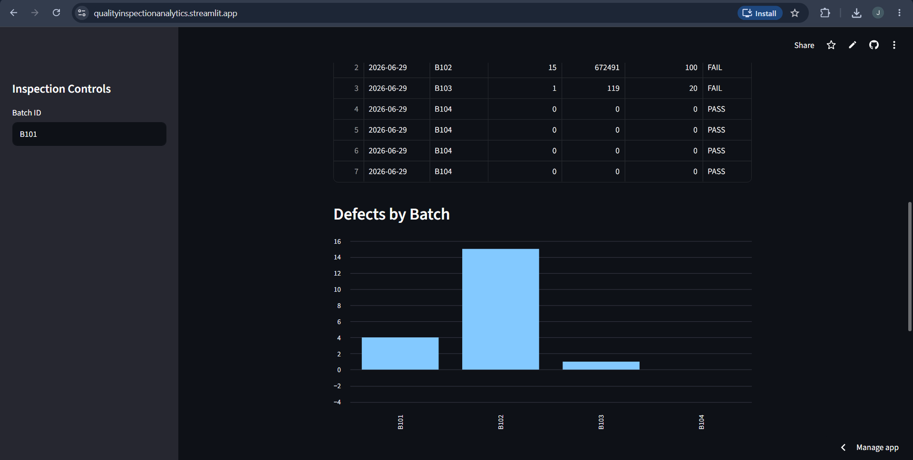
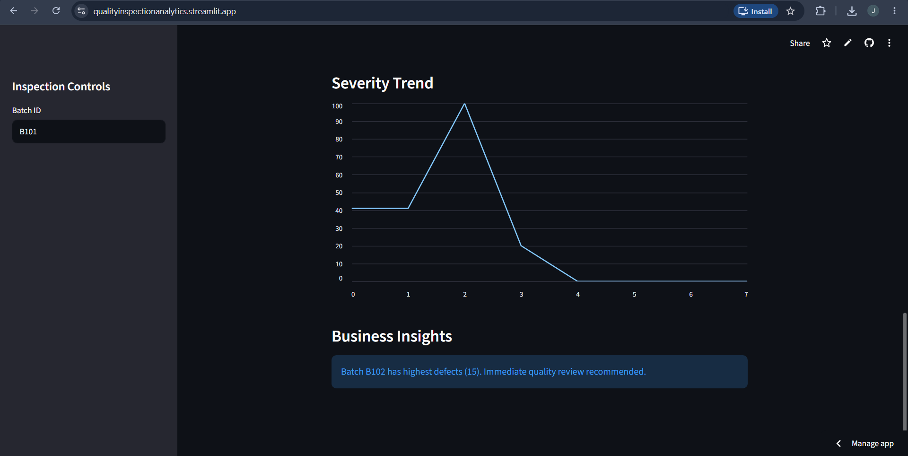

# AI-Powered Quality Inspection & Defect Analytics Platform

An industrial analytics platform built using **Python, OpenCV, Pandas, and Streamlit** for automated defect detection, quality monitoring, and analytics-driven decision support.

This project combines **computer vision** with **business analytics** to inspect mechanical components, quantify defect severity, and generate actionable quality insights through an interactive dashboard.

---

## Project Overview

In manufacturing industries, manual inspection is time-consuming and prone to human error.
This system automates inspection by comparing a **reference (ideal) component image** with a **test component image**, detecting anomalies using image processing techniques.

Unlike basic inspection tools, this platform also stores historical inspection data and performs analytics such as:

* Failure rate tracking
* Batch-wise defect analysis
* Severity trend monitoring
* Risk classification
* Recommendation generation

---
## Live Demo

🔗 [Launch Web App](https://qualityinspectionanalytics.streamlit.app/)
---
## Features

* Automated defect detection using OpenCV
* Reference and test image comparison
* Grayscale preprocessing
* Absolute difference computation
* Thresholding and contour detection
* Bounding box generation around defects
* PASS / FAIL classification
* Defect severity scoring
* Risk level classification
* Recommendation engine
* Historical inspection logging
* Interactive analytics dashboard

---

## Tech Stack

* Python
* OpenCV
* Streamlit
* Pandas
* Matplotlib

---

## Project Architecture

```text
Image Upload
    ↓
Computer Vision Detection Engine
    ↓
Defect Metrics Extraction
    ↓
Analytics Engine
    ↓
Interactive Dashboard
```

---

## Metrics Tracked

* Defect Count
* Total Defect Area
* Severity Score
* Pass Rate
* Failure Rate
* Batch-wise Defect Count
* Severity Trend

---

## Screenshots

### Main Dashboard



### Inspection Results



### Batch-wise Defect Analysis



### Severity Trend



---

## Business Insights Generated

The platform converts raw inspection outputs into decision-support insights such as:

* Identifying high-risk batches
* Tracking defect severity over time
* Monitoring quality degradation trends
* Recommending quality-control actions

Example insight:

> Batch B104 shows the highest defect rate and requires immediate quality review.

---

## Applications

* Industrial Automation
* Manufacturing Quality Control
* Smart Factory Monitoring
* Defect Analytics
* Operational Risk Assessment

---

## Installation

```bash
pip install -r requirements.txt
```

---

## Run Locally

```bash
streamlit run app.py
```

---

## Future Improvements

* Deep learning–based defect classification
* Real-time camera feed inspection
* Cloud database integration
* Predictive failure analytics

---

Built as a project to explore **Computer Vision, AI, Analytics, and Data-Driven Decision Support Systems**.
